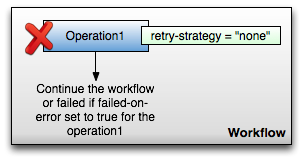

Retry Strategies
================

Integration of retry strategies
-------------------------------
To improve the management of failing workflow operations, there were developed two new ways to manage failing operations. The first one, called “retry strategies for workflow operations”, allows a workflow administrator to define what should happen if an operation failed. The failover strategy, the second one, solves the leak of logic for the job retry in the service registry and helps to identify problematic services. The following paragraphs will present these two implementations and explain how it works.

Retry strategies for workflow operations
----------------------------------------
Until today, if a workflow operation failed, nothing else than a simple retry was possible to do. The goal of this retry strategies implementation is to allow the workflow administrator to define the way to proceed in case of failure, and that for each operation.

The action to execute in case of operation failure can be chosen between the three strategies: `hold`, `none` and `retry`. It can be set in the workflow definition via the `retry-strategy` parameter like in the following example.

```
<operation
  id="operation1"
  retry-strategy="none"
  max-attempts="2"
  fail-on-error="true"
  exception-handler-workflow="error"
  description="Failing operation">
</operation>
```
_Note: `max-attempts` is only relevant when `retry-strategy` is set to `retry`._

The `hold` strategy will place the workflow in hold mode after the operation failure. After it, the administrator will have to select the retry strategy for the operation in the administration interface. The possible strategies are the two presented below: `retry` and `none`.


With the `none` strategy, nothing would be done in case of operation failure. The operation would simply left failed.



A failed operation will be restarted with the `retry` strategy. The operation will be retried as many times as indicated by the parameter `max-attempts` (which defaults to `2`). If the operation fails `max-attempts` times, then it will be left definitely at this state.


Failover strategy
-----------------
Presentation
Through the implementation of retry strategies for the workflow operations, a need to have a default retry/failover strategy after a job failure has been discovered. Before this implementation, if a job failed, nothing else than a simple retry was possible to execute. Matterhorn being a modular product with many services possibly distributed on different hosts, it is better to add some logic in the jobs dispatching method and manage services states. It avoids many retries on a service causing systematically a job failure and allows to identify this kind of services.

How it works
Globally the logic has been added in the serviceRegisteryJpaImpl. It is where the job are dispatched on the service and where they are updated. So it is clearly the good place to modify the services filtering and handle failed job.

Some informations have been added to implement the strategy like in the flow chart above. Firstly, the serviceRegistration offers now a field to inform about its current state. This service state can be set as NORMAL | WARNING | ERROR. Two others informations related to this state can be inserted in the serviceRegistration: the date of the state changed and the signature from the job that triggered it. It is now possible to get the signature from a job (composed of is job type and arguments). This is important to identify identical because when a job failed, it is not exactly the same that is relaunched but a new one with same parameters.

All theses informations are updated in the UpdateServiceForFailover method in the ServiceRegistery. This method is called each a newly failed are finished job is updated. The service state are then use to filter services before to dispatch a job. Services in ERROR state are avoid and NORMAL services preferred as WARNING.
